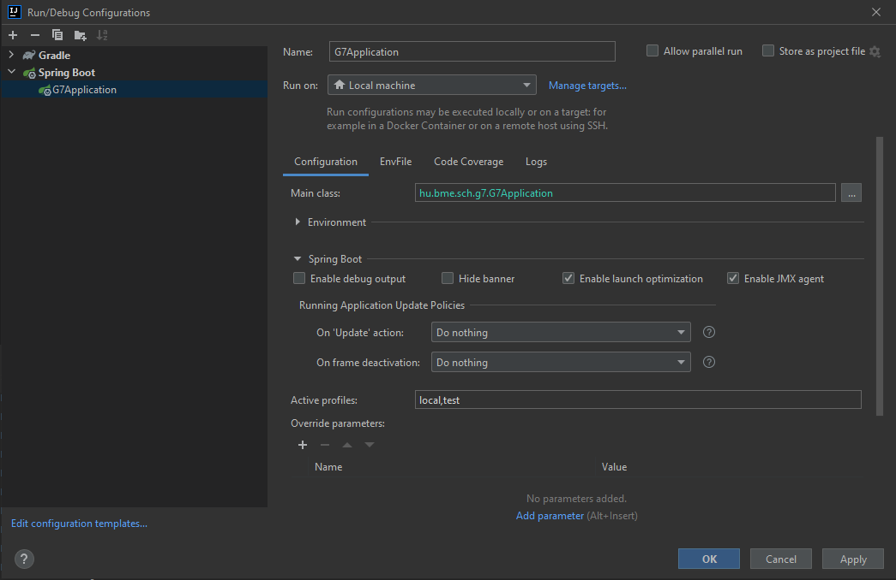

CMSch web backend with in-built frontend
===

## Build docker

```bash
  docker build -t g7-web-backend .
```

## Publish

```bash
  docker login registry.k8s.sch.bme.hu
  docker image tag g7-web-backend:latest registry.k8s.sch.bme.hu/g7-web/g7-web-backend:latest
  docker image push registry.k8s.sch.bme.hu/g7-web/g7-web-backend
```

## Run (you can start here)

For develpment:

```bash
  docker run --rm -p 8080:80 \
        -e AUTHSCH_CLIENT_ID=20_CHARS \
        -e AUTHSCH_CLIENT_KEY=80_CHARS \
        -e PROFILE_SALT=RANDOM_STRING \
        -e SYSADMINS=YOUR_AUTH_SCH_UUID \
        g7-web-backend
```

or from the registry: **YOU MIGHT PROBABLY WANT TO START WITH THIS**

```bash
  docker pull registry.k8s.sch.bme.hu/g7-web/g7-web-backend
  docker run --rm -p 8080:80 \
        -e AUTHSCH_CLIENT_ID=20_CHARS \
        -e AUTHSCH_CLIENT_KEY=80_CHARS \
        -e PROFILE_SALT=RANDOM_STRING \
        -e SYSADMINS=YOUR_AUTH_SCH_UUID \
        registry.k8s.sch.bme.hu/g7-web/g7-web-backend
```

## Where to start?

- Api docs: BASE_URL/swagger-ui.html
- Admin UI: BASE_URL/admin/control/basics
- API: BASE_URL/api/... (see swagger for more)

## Application local properties

Create an application-local.properties file in the `src/main/resources/config` folder, 
and fill the file with these configurations (using your credentials): 

```properties
authsch.client-identifier=<insert the shorter key>
authsch.client-key=<insert the long key>

g7web.default-group-name=I16
g7web.frontend.production-url=http://localhost:3000
```

Once created, edit the run config's Spring Boot Active Profiles to use 



- `local,test` if you want test data in the database also
- `local` if you don't

## Client side solutions

### Client in the Backend

Running both the React dev-server and Spring server will NOT trigger CORS related problems, as it's been configured to allow
the dev-server to make requests to the Spring server with this annotation:

```kotlin
@CrossOrigin(origins = ["\${g7web.frontend.production-url}"], allowedHeaders = ["*"])
@RestController
@RequestMapping("/api")
class MainController() {  ...  }
```

Don't forget to include the `g7web.frontend.production-url` property in the `application-local.properties` file with the
value of `http://localhost:3000` (this is the React dev server's address).

### In production mode

The gradle building task will build the react app's files into the static directory of our Spring app, from where the
Spring backend app will serve the built js files, they will access easily the Spring app backend through axios API. This
will not induce CORS related problems, both the backend and these static files will be served by Tomcat in Spring app's 
domain.

If you need to declare a new client environment variable, create it in the `src/main/resources/configurations/application.properties`
file and modify the `build.gradle.kts` script (approx. line 97) to include the new property in the built .env file.

When in development mode, you can freely change the .env file. **WARNING**: Gradle build will override the existing .env
file so always have an .env.development file in the client repo as a backup.

Read more in the `src/main/client/README.md` file.

### Recommended development workflows

- Open IDEA or Webstorm to run Gradle run to serve the Spring app, edit the client code in VSCode or any text editor of 
your choice, save, then restart the Spring app to rebuild the frontend also. You might find the client side result on 
`localhost:8080/index.html` (as of now).
- **More recommended:** Open IDEA or Webstorm to run Gradle run to serve the Spring app, start up the React dev-server in 
the `src/main/client` folder (with `yarn start`) and edit the code in VSCode or any text editor of choice, save, the client served on `localhost:3000`
will watch for alterations, will rebuild, so you can easily develop frontend without the need of rebuilding the Spring app
every time.
